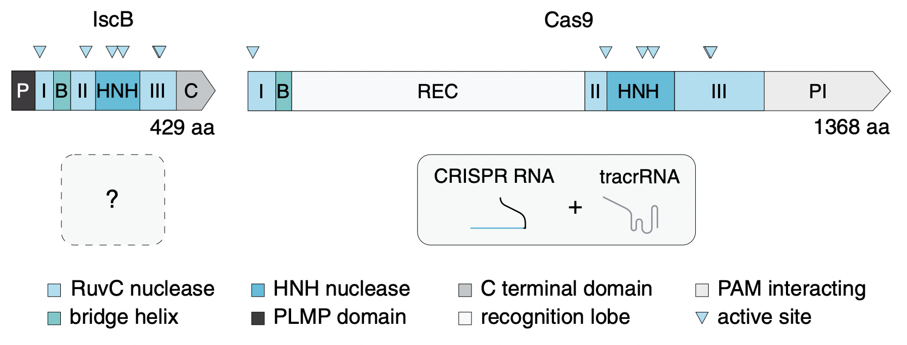

# Protein design

## The widespread IS200/IS605 transposon family encodes diverse programmable RNA-guided endonucleases

## ML based protein design: Design by adaptive sampling (DbAS)
- **Model-based optimization**
  - Instead of the optimization problem
    - $\max_{x \in \mathcal{X}} f(x)$
  - We solve the optimization problem
    - $$\max_{\theta \in \R^d} \E_{p(x|\theta)}[f(x)]$$

