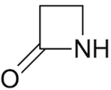

# Variant modeling with Evolutionary Scale Modeling ([ESM](https://github.com/facebookresearch/esm))

We will be predicting the effect of missense mutations on the structure of **beta-lactamase**, enzymes produced by bacteria that provide antibiotic resistance to [**beta-lactam** (four member carboxamide ring) antibiotics](https://www.khanacademy.org/test-prep/mcat/physical-sciences-practice/physical-sciences-practice-tut/e/the-chemical-structure-consequences-of-beta-lactams).

## Reference Papers
- Evolutionary Scale Modeling: [Biological structure and function emerge from scaling unsupervised learning to 250 million protein sequences](https://www.ncbi.nlm.nih.gov/pmc/articles/PMC8053943/)
- Envision paper: [Quantitative Missense Variant Effect Prediction Using Large-Scale Mutagenesis Data](https://www.cell.com/cell-systems/pdfExtended/S2405-4712(17)30492-1)