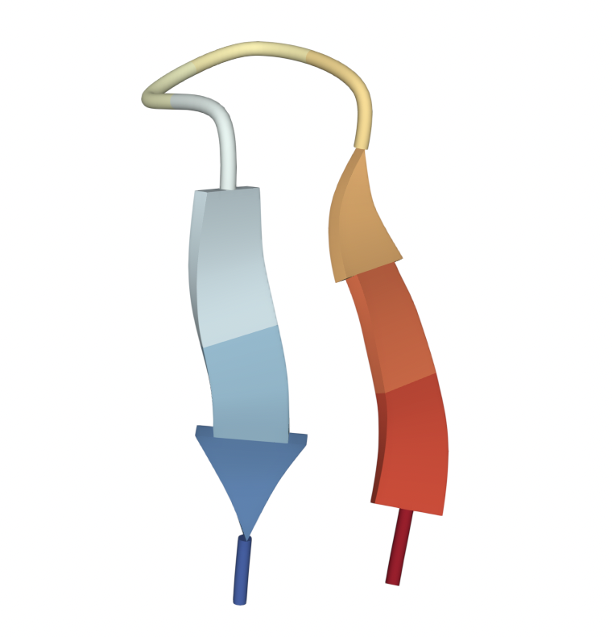

# Disordered proteins (DPs)

## Progress in studying intrinsically disordered proteins with atomistic simulations (2015)
- **intrinsically disordered proteins (IDPs)**. proteins that lack fixed secondary and tertiary structure 
- disordered regions (DR) are found in more than 50% of proteins in eukaryotes
- DRs are enriched in **regulatory** and **signaling** proteins
- functional advantages
  - can bind multiple different partners
  - form weak but highly specific interactions
  - frequent targets of post-translational modifications
- IDPs are involved in
  - cancer
  - cardiovascular disease
  - Alzheimer's
  - Parkinson's
  - type 2 diabetes: **human islet amyloid polypeptide (hIAPP)**
- most DPs are **polyampholytes**: enriched in charged residues and depleted in hydrophobic residues.

### Timescales
- $\alpha$-helices and $\beta$-hairpins: 0.1-10µs
- proteins can take **µs to ms** to fold
- meaningful IDP transitions will take place on the same timescale (**up to ms**)

<Image width="200px">

Beta-hairpin secondary structure.

</Image>

### Extensive all-atom simulations of IDPs
- examples of how simulations of IDPs has advanced biological understanding

#### 1<SPACE/> **Post-translational modifications and IDPs**
- definitions
  - **KID**. kinase inducible domain
  - **CREB**. cAMP response element-binding protein; a transcription factor
  - **CBP**. CREB binding protein; has acetyltransferase functions
- KID is a domain of CREB
- KID phosphorylated at Ser133 lets it bind to CBP
- phosphorylation means that CREB can stay in metastable state longer (**kinetics is favorable**), which can lead to a 10x increase in binding affinity

#### 2<SPACE />**Aggregations of IDPs**