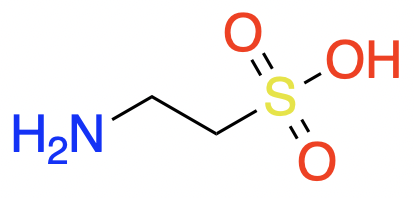

# Multiomics of the gut microbial ecosystem in inflammatory bowel diseases

- Crohn's disease (CD): gastrointestinal tract
- Ulcerative colitis (UC): colon

## Dataset
- HMP2
  - 132 subjects
    - Five academic medical centers
      - 3 Pediatric
        - Cincinnati Children's Hospital (CCH)
        - Massachusetts General Hospital (MGHP)
        - Emory University Hospital (EUH)
      - 2 Adult
        - Massachusetts General Hospital (MGHA)
        - Cedars-Sinai Medical Center (CSMC)
  - 2965 total samples (stool, biopsy, blood)
- stool samples
  - metagenomics (MGX)
  - metatranscriptomics (MTX)
  - metaproteomics (MPX)
  - metabolomics (MBX)
  - viromes (VX)
- 92 exome sequences
- biopsies
  - human transcriptomics (HTX)
  - epigenetic reduced representation bisulfite sequencing (RRBS)
  - 16S rRNA gene amplicon sequencing (16S)
- simple differences between IBD and non-IBD was in **metabolome**
- IBD had more PUFA
  - adrenate, arachidonate
- IBD had depleted
  - B5 and B3
  - both required to produce cofactors for lipid metabolism
  - B3 has anti-apoptotic and anti-inflammatory functions in the gut
  - nicotinuric acid (metabolite of B3) was found exclusively in stool of IBD
- no metagenomic species were significantly different between IBD and control (after MHT)
- samples with taxonomic profiles differing from control samples were called **dysbiotic**
- durations between dysbiotic periods were exponentially distributed (transitions are likely triggered by events with constant probability over time)
- at CpG sites, C can be methylated (epigenomics)

- Increase in **facultative anaerobes (FA)**
- Decrease in **obligately anaerobic (OA)** producers of **short-chain fatty acids (SCFAs)**
- another metabolite finding: large changes in **acylcarnitine**
  - carnitines are microbially modified compounds that can have different phenotypic effects depending on the specific modifications
- 117/548 other metabolites also significant differences in dysbiotic

### Decreased gut microbiome stability in IBD (stool samples)
- for patients with UC/CD, microbiome make-up could be completely different at a later point in time (longitudinal)
- gene family transcripts, proteins both vary rapidly (large change over 2 week period) in control, UC, and CD patients
  - disease does **not** have more extreme excursions
- dynamic microbiomes (μB)
  - all groups had dynamic (changing) µB
  - differed in species that changed
  - control groups
    - cycles of _Prevotella copri_
    - _P. copri_ is a population scale outgroup and enriched in **new onset rheumatoid arthritis**
- in patients with IBD, taxonomic shifts (TS) were associated with entering/exiting **dysbiosis**
- metabolite shifts
  - looking at Δmetabolites between adjacent samples
  - PCoA on Δs yields ssgn separation
  - metabolites with Δs are _unknown compounds_
  - of known compounds, primary contributors to shifts:
    - methylimidazole acetic acid
    - urate

### Microbiome associated host factors
- incorporate host molecular measurements, primarily from **intestinal biopsies taken at baseline**
- **tissue location** is a major driver of intestinal epithelial gene expression
- differential gene expression
  - 305: ileum (CD vs. control)
  - 920: rectum (CD+UC vs. control)
  - used negative binomial model
  - included genes affecting commensal microorganisms
    - directly
      - **CXCL6**
      - **SAA2**
    - indirectly
      - **DUOX2**
      - **LCN2**
  - KEGG pathway enrichment analysis with _hypergeometric distribution_
    - found enrichment (e+) of immune-related pathways
      - **IL-17 signalling pathway**
      - **complement cascade**
- goal: identify microbes most associated with DEGs
  - find mRNA transcripts that covaried with relative abundance of microorganisms (same specimens, using 16S amplicon)
  - included DUOX2, DUOXA2
  - included CXCL6, CCL20

### Dynamic, multi-omic microbiome interactions
- _E. coli_ accounted for large fraction of upregulated ECs
- _F. prausnitzii_ accounted for downregulation of various EC pathways.
- _Roseburia_ associated MTX+MGX with bile acids and acylcarnitines
- biochemical hubs
  - C8 carnitine
  - cholate
  - chenodeoxycholate
  - taurochenodeoxycholate
- host genes in networks
  - GIP
  - NXPE4
  - ANXA10
- microbial communities may be in higher growth conditions in dysbiotic IBD
- unclassified _Subdoligranulum_ species was markedly reduced in IBD yet central to functional network of metabolites

## Abbrevations
- **ASCA**. anti-_Saccharomyces cerevisiae_ antibodies
- **ANCA**. anti-neutrophil cytoplasm antibodies
- **OmpC**. outer membrane protein C
- **CBir1**. flagellin
- **alpha diversity**. the mean diversity of species in different sites or habitats within a local scale
- **KO**. KEGG Orthologues
- **KEGG**. Kyoto Encyclopedia of Genes and Genomes
- **ordination**. a statistical technique in which data from a larger number of sites or populations are represented as points in a two or three dimensional coordinate frame
- **Bray-Curtis principal coordinates**.
- **EC**. Enzyme Commission gene families

## TODO
- figure out unknown metabolites driving diagnosis separation
- how is the metabolome determined experimentally?
- mixed-effects model
- **strain-level profiling of implicated microorganisms**