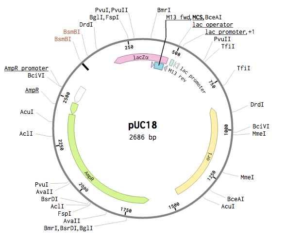

# Golden Gate Assembly

- **open reading frame (ORF)**. a span of genetic material that can be read by genetic machinery to produce a protein.
- **ORF library**. a collection of variuses modified to encode ORFs. These viruses infect cells on a dish, and the ORFs are passed into the living cells, which then begin expressing the ORF.[^orf]
- **Type IIs restriction enzymes**. Cut outside of their recognition site, so the DNA overhangs can consist of any nucleotide.
- **subcloning**. a technique that transfers DNA inserts from one vector to another.
  - This is the _physical process_ used to _build_ a plasmid vector.

[^orf]: [What is an ORF? (Broad Institute)](https://www.broadinstitute.org/blog/what-orf) ([archive](https://archive.is/4NVZH))