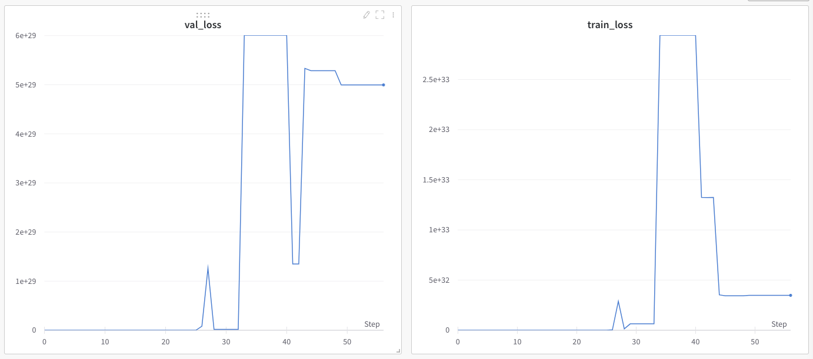
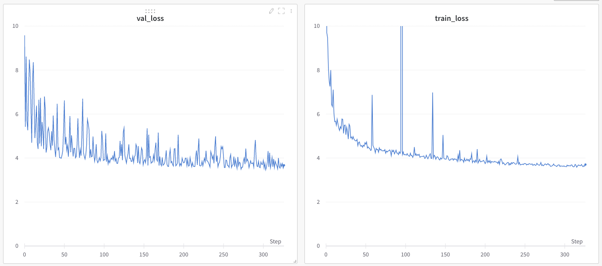
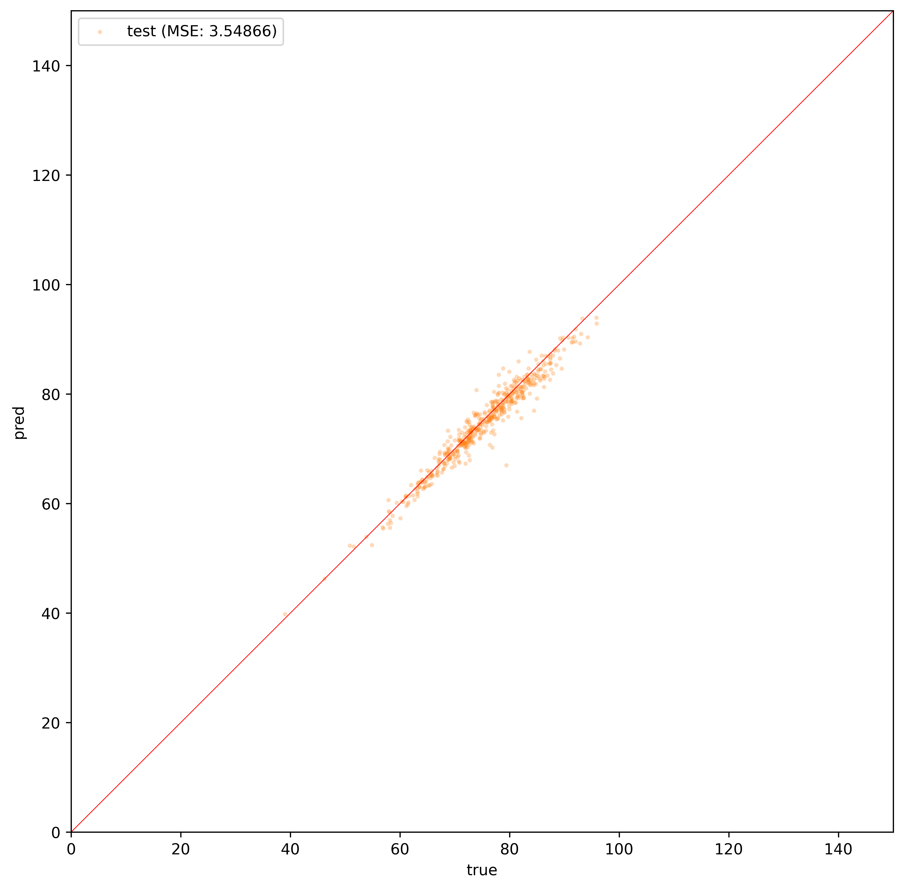

# A year of machine learning

## Long term plans

### Graphs
- [ ] CS224W 2021: Machine Learning with Graphs
    - [Course content](https://web.stanford.edu/class/cs224w/index.html)
    - [Video lectures](https://www.youtube.com/playlist?list=PLoROMvodv4rPLKxIpqhjhPgdQy7imNkDn)
- [ ] [`github.com/gnnpapers`](https://github.com/thunlp/GNNPapers)
    - [ ] [Foundations and modelling of dynamic networks using Dynamic Graph Neural Networks: A survey.](https://arxiv.org/abs/2005.07496)
- [ ] Graph Representation Learning

### Engineering
- Python
    - [ ] Practices of the Python Pro
    - [ ] Intuitive Python
- [ ] PyTorch
- [ ] [`pytorch_geometric`](https://pytorch-geometric.readthedocs.io/en/latest/index.html)
- [ ] [Hydra](https://hydra.cc/docs/intro/)
- [ ] NetworkX
- [ ] JAX
    - [ ] Haiku
    - [ ] Jraph

### Datasets
- Chemistry
    - [ ] METLIN
    - [ ] QM9
    - [ ] QM7

### Math
- [ ] Real analysis
- [ ] Matrix calculus
- [ ] Statistics
- [ ] Information theory
- [ ] Spatial graph theory (graph theory and geometry)

### Foundations
- [ ] Transformers
- [ ] Variational Autoencoders

## Day 1 (Jan 1, 2022)

## Day 2 (Jan 2, 2022)
- set up `compute` machine

## Day 3 (Jan 3, 2022)
- found resources related to Graph Neural Networks, in particular the Stanford CS224W class.

## Day 4 (Jan 4, 2022)

## Day 5 (Jan 5, 2022)

## Day 6 (Jan 6, 2022)

## Day 7 (Jan 7, 2022)

## Day 8 (Jan 8, 2022)
- examined triangle attention in AlphaFold to understand how the triangle inequality is enforced
    - soft constraint
- FAPE penalizes incorrect chirality

## Day 9 (Jan 9, 2022)
- [The Illustrated Transformer](https://jalammar.github.io/illustrated-transformer/)
    - $\frac{Q\tr{K}}{\sqrt{d_k}} V$
- Layer normalization
- CS224W, introduction to PyTorch Geometric

## Day 10 (Jan 10, 2022)

## Day 11 (Jan 10, 2022)
- Start work on ML4MolEng

## Day 14 (Friday, Jan 14, 2022)
- Adam optimizer sometimes causes the loss to have a massive jump (see `lemon-sky-7`), and thus I added a clipping norm.
    - `torch.nn.utils.clip_grad_norm_(model.parameters(), clipping_norm)`
- Continue to examine reasons for [spikes in Adam training](https://stats.stackexchange.com/questions/303857/explanation-of-spikes-in-training-loss-vs-iterations-with-adam-optimizer).

## Days 15, 16, 17
- Took a break (Boston vacation)

## Day 18 (Tuesday, Jan 18, 2022)
## Day 19 (Wednesday, Jan 19, 2022)
## Day 20 (Thursday, Jan 20, 2022)
## Day 21 (Friday, Jan 21, 2022)